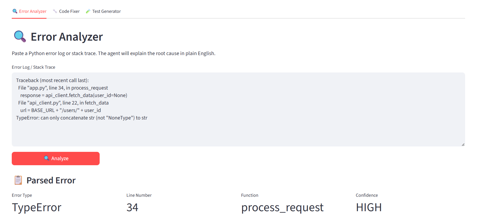
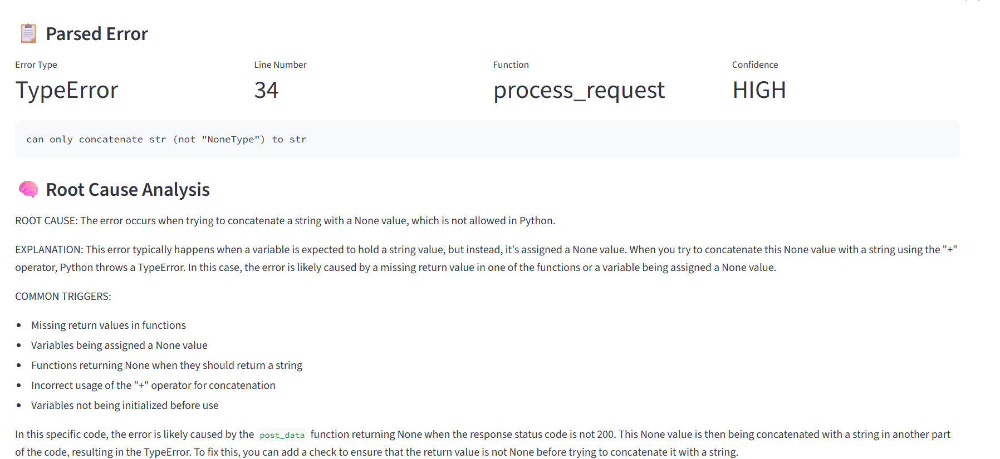
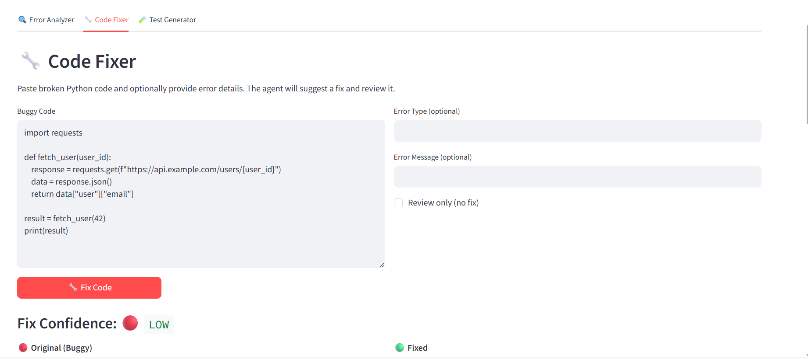
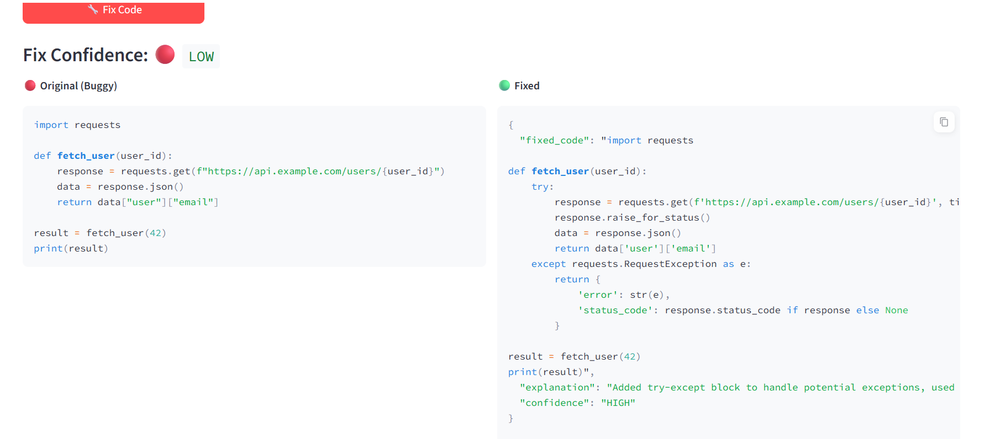
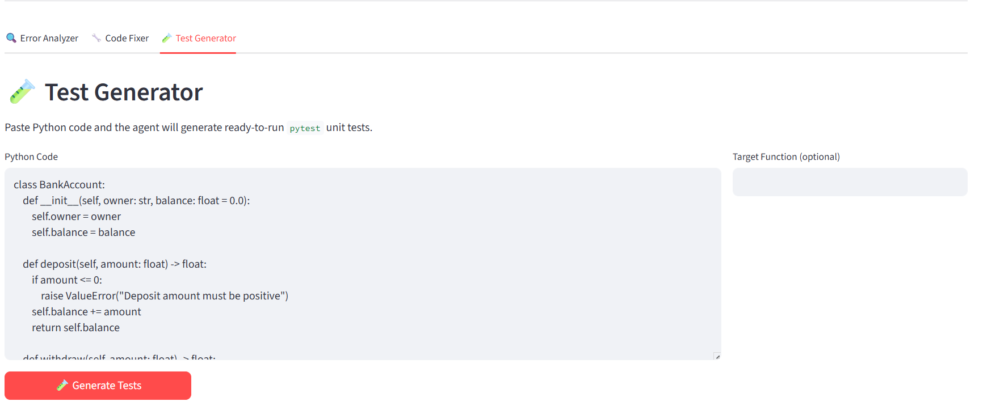
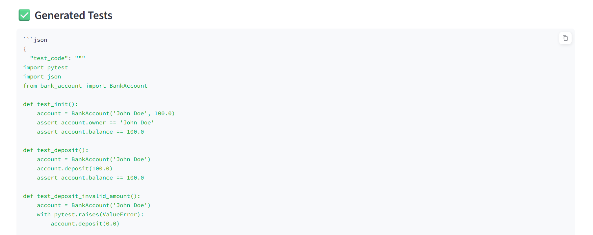

# Agentic Developer Copilot

A multi-agent system that analyzes Python error logs, suggests fixes, and generates unit tests — built with LangGraph, MCP, and Llama 3.1.

Built by Jaswant.

---



---

## What it does

The copilot runs three specialized agents in a LangGraph pipeline:

1. **Log Analyzer** — parses stack traces with regex, searches the codebase for similar code via FAISS, then asks an LLM to explain the root cause in plain English.
2. **Code Fixer** — takes the parsed error context, finds similar working code, generates a fix, and runs an automated code review on the result.
3. **Test Generator** — extracts functions via AST and generates ready-to-run `pytest` tests, targeting the fixed code when available.

The pipeline is task-aware — calling it with `task="analyze"` runs only the log analyzer; `task="full"` chains all three agents.

---

## Architecture

```
Error Log / Code
       │
       ▼
  [LangGraph Orchestrator]
       │
       ├──▶ LogAnalyzerAgent  ──▶ FAISS semantic search
       │         │                     (similar code context)
       │         ▼
       ├──▶ CodeFixerAgent    ──▶ FAISS + LLM fix + review
       │         │
       │         ▼
       └──▶ TestGeneratorAgent ──▶ AST extraction + LLM tests
                 │
                 ▼
          Final Report
```

**Stack:** LangGraph · MCP · FAISS · Llama-3.1-8B (via HuggingFace/Novita) · FastAPI · Streamlit

---

## Demo

| Error Analyzer | |
|---|---|
|  |  |

| Code Fixer | |
|---|---|
|  |  |

| Test Generator | |
|---|---|
|  |  |

---

## Evaluation

Evaluated on 7 test cases (3 log analysis, 2 code fix, 2 test generation) using custom metrics: field extraction accuracy, keyword presence, pytest pattern matching, and LLM output quality.

| Agent | Score |
|---|---|
| LogAnalyzerAgent | 0.933 |
| CodeFixerAgent | 1.000 |
| TestGeneratorAgent | 0.800 |
| **Overall** | **0.911** |

Run the evaluation yourself:
```bash
python evaluation/eval.py
```

---

## Getting Started

### Prerequisites

- Python 3.11
- [HuggingFace account](https://huggingface.co) with API token
- Novita AI account (or swap `LLM_PROVIDER` in `config.py` for another provider)

### Local setup

```bash
git clone https://github.com/Jaswant-Singh-Agore/agentic-dev-copilot
cd agentic-dev-copilot

conda create -n dev_copilot python=3.11
conda activate dev_copilot
pip install -r requirements.txt
```

Create a `.env` file:
```
HF_TOKEN=your_huggingface_token_here
```

Build the FAISS index (point it at your codebase):
```bash
python -c "from pipeline.indexer import build_index; build_index('data/sample_code')"
```

Start the FastAPI backend:
```bash
python app/api.py
```

Start the Streamlit frontend (in a separate terminal):
```bash
streamlit run streamlit_app.py
```

Open `http://localhost:8501`.

### Deploy to Render + Streamlit Cloud

**Backend (Render):**
1. Push to GitHub
2. Create a new Render Web Service, point it at your repo
3. Set build command: `pip install -r requirements.txt`
4. Set start command: `uvicorn app.api:app --host 0.0.0.0 --port $PORT`
5. Add `HF_TOKEN` as an environment variable in the Render dashboard

**Frontend (Streamlit Cloud):**
1. Go to [share.streamlit.io](https://share.streamlit.io)
2. Connect your GitHub repo, set main file to `streamlit_app.py`
3. In secrets, add: `HF_TOKEN = "your_token"`
4. Update `API_BASE_URL` in `streamlit_app.py` to your Render backend URL

---

## Project structure

```
agentic-dev-copilot/
├── agents/
│   ├── log_analyzer.py       # Agent 1 — parses errors, explains root cause
│   ├── code_fixer.py         # Agent 2 — suggests fixes, reviews code
│   └── test_generator.py     # Agent 3 — generates pytest tests
├── mcp_server/
│   ├── __init__.py
│   └── tools.py              # 6 MCP tools (parse, fix, review, test, extract)
├── pipeline/
│   ├── orchestrator.py       # LangGraph state machine
│   └── indexer.py            # FAISS index build + search
├── app/
│   └── api.py                # FastAPI — 6 endpoints
├── evaluation/
│   ├── eval.py               # Custom evaluation runner
│   └── eval_results.json     # Latest results
├── streamlit_app.py          # 3-tab Streamlit UI
├── config.py                 # Centralised config with env validation
├── demo.py                   # Quick smoke test
└── requirements.txt
```

---

## API endpoints

| Method | Endpoint | Description |
|---|---|---|
| GET | `/health` | Health check |
| POST | `/analyze-log` | Parse error log and explain root cause |
| POST | `/fix-code` | Suggest a fix for buggy code |
| POST | `/review-code` | Code review without fix |
| POST | `/generate-tests` | Generate pytest unit tests |
| POST | `/run-pipeline` | Run full multi-agent pipeline |
| GET | `/index-status` | Check FAISS index status |

---

## License

MIT
